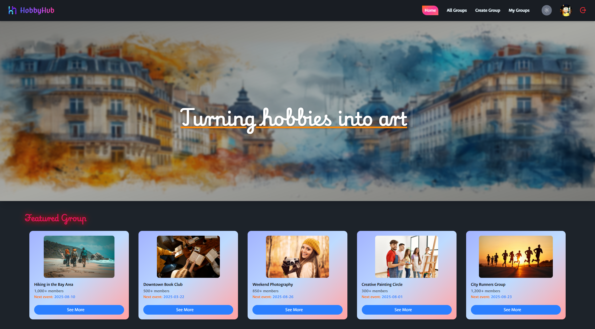

# 🎨 HobbyHub

**HobbyHub** is a platform where people can discover and join local hobby-based groups (e.g., book clubs, hiking crews, painting circles) or create their own. It encourages social engagement through shared interests, helping people build communities around their passions.



---

## **Live Site:** [HobbyHub](https://hobby-hub-a8201.web.app/)

## 🚀 Features

- 🔐 **Authentication** with Firebase (Login, Logout, Protected Routes)
- 👥 **Create / Join Hobby Groups**
- 🧠 **Manage Your Groups**
- 🌙 **Dark & Light Theme Toggle**
- 🎯 **Responsive for** — Mobile, Tablet and Desktop
- 🧩 **Modern UI** with TailwindCSS & React Icons
- 🖼️ **Profile Image Tooltips** and interactive elements
- ⚡ **Loading States** with smooth animations and spinners
- 🧪 **Toast Notifications** for user feedback

---

## 🛠️ Tech Stack

| Tech                                                       | Description                 |
| ---------------------------------------------------------- | --------------------------- |
| [React.js](https://reactjs.org/)                           | Frontend Library            |
| [React Router](https://reactrouter.com/)                   | Navigation & Routing        |
| [Firebase Auth](https://firebase.google.com/products/auth) | User Authentication         |
| [TailwindCSS](https://tailwindcss.com/)                    | Utility-First CSS Framework |
| [React Hot Toast](https://react-hot-toast.com/)            | Notifications               |
| [React Tooltip](https://react-tooltip.com/)                | Tooltips for UI elements    |
| [React Icons](https://react-icons.github.io/react-icons/)  | Beautiful icons             |

---

## 🧭 Folder Structure

```
📁 src
├── 📁 assets         # Static images like logo, user icon
├── 📁 components     # Reusable UI components (Navbar, ThemeToggle)
├── 📁 context        # AuthProvider with loading & user states
├── 📁 pages          # Pages like Home, All Groups, Create Group
├── 📁 routes         # ProtectedRoute components (if used)
├── App.jsx
└── main.jsx
```

---

## 💻 Getting Started

1. **Clone the repo**

```bash
git clone https://github.com/rashikdev/hobbyhub.git
cd hobbyhub
```

2. **Install dependencies**

```bash
npm install
```

3. **Set up Firebase**

- Create a Firebase project
- Enable Authentication (Email/Password or Google)
- Add your Firebase config to `AuthProvider.jsx`

4. **Run the project**

```bash
npm run dev
```

---

## 🙌 Author

Made with ❤️ by **[Md. Rahsik]**  
📧 Email: mdrashikpdf@gmail.com
